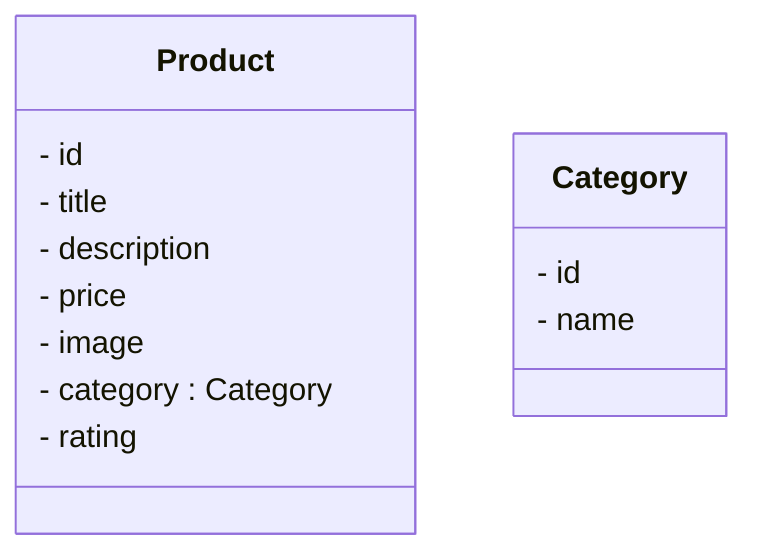

# Product Catalogue Service

**PRD (Product Requirements Document) -** https://docs.google.com/document/d/1Gn2ib5YhhpcFUiWGAUbCpg0ZPh3m_wSA-9IolGMjkIE/edit#heading=h.hteovoit9b96

This is a service that handles all products.

## Class Diagram



> How can we Inject Dependencies?

By using the `@Autowired` annotation. This can be used in 3 ways:

1. **Constructor Injection:** This is the most preferred and readable approach. Use the annotation on top of a Constructor.
2. **Field Injection:** This is not preferred as it makes the code less readable and difficult to test. Use the annotation on top of a Class Field.
3. **Method Injection:** This is also not preferred as it makes the code less readable and difficult to test. Use the annotation on top of a Class Method.

> If the contract from the third party changes, should it impact our whole application?

No. It should not impact everything, and for this reason, we create DTOs. To interact with any third-party application.

> What does a JSON most resemble to?

`Map<String, Object>`
```
Map<id, 1>
Map<title, "bag">
...
```

But here, if the key name changes a bit, or if the value's datatype changes, the code will break, and it's difficult to communicate this contract to a client.

Instead, we can use an Object Mapper, that maps the JSON map to the desired class object.

## JSON vs Protobuf

`Communication Flow: Client <-> Server
`
### JSON

- **Format:** Text-based (often transmitted as UTF-8 encoded bytes)
- **Pros:**
  - *Human-readable:* Easy to understand and debug.
  - *Shema-less:* Flexible data structures, no upfront schema definition needed.
  - *Widely supported:* Integrates well with web technologies like Javascript.
- **Cons:**
  - *Larger message size:* Less efficient for network transmission.
  - *Slower processing:* Serialization and deserialization can be slower.

### Protobuf

- **Format:** Compact binary format
- **Pros:**
  - *Smaller message size:* Improves network transmission efficiency.
  - *Faster processing:* Encoding and decoding are generally faster than JSON.
  - *Schema-based:* Ensures data compatibility and avoids errors.
- **Cons:**
  - *Not human-readable:* Debugging can be more challenging.
  - *Requires schema definition:* Upfront effort to define the data structure.
  - *Less widely supported:* Might require additional libraries for some languages.

### Choosing the Right Format

- Use JSON for:
  - Human-readable data exchange.
  - Integration with web technologies.
  - Flexible data structures.
- Use Protobuf for:
  - Performance-critical applications.
  - Reducing network traffic.
  - Ensuring data consistency between sender and receiver.

**Note:**

**Security:** Neither JSON nor Protobuf offers inherent security. Encryption is needed for secure data exchange.


https://protobuf.dev/
