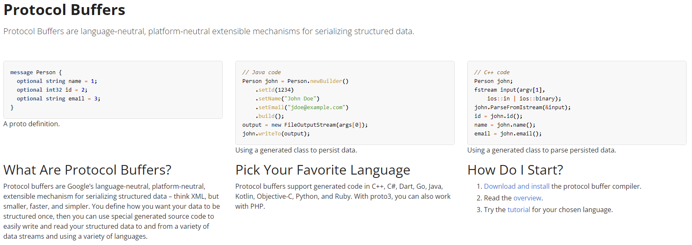

# Product Catalogue Service

**PRD (Product Requirements Document) -** https://docs.google.com/document/d/1Gn2ib5YhhpcFUiWGAUbCpg0ZPh3m_wSA-9IolGMjkIE/edit#heading=h.hteovoit9b96

This is a service that handles all products.

## Class Diagram


> How can we Inject Dependencies?

By using the `@Autowired` annotation. This can be used in 3 ways:

1. **Constructor Injection:** This is the most preferred and readable approach. Use the annotation on top of a Constructor.
2. **Field Injection:** This is not preferred as it makes the code less readable and difficult to test. Use the annotation on top of a Class Field.
3. **Method Injection:** This is also not preferred as it makes the code less readable and difficult to test. Use the annotation on top of a Class Method.

> If the contract from the third party changes, should it impact our whole application?

No. It should not impact everything, and for this reason, we create DTOs. To interact with any third-party application.

> What does a JSON most resemble to?

`Map<String, Object>`
```
Map<id, 1>
Map<title, "bag">
...
```

But here, if the key name changes a bit, or if the value's datatype changes, the code will break, and it's difficult to communicate this contract to a client.

Instead, we can use an Object Mapper, that maps the JSON map to the desired class object.

## JSON vs Protobuf

`Communication Flow: Client <-> Server
`
### JSON

- **Format:** Text-based (often transmitted as UTF-8 encoded bytes)
- **Pros:**
  - *Human-readable:* Easy to understand and debug.
  - *Schema-less:* Flexible data structures, no upfront schema definition needed.
  - *Widely supported:* Integrates well with web technologies like Javascript.
- **Cons:**
  - *Larger message size:* Less efficient for network transmission.
  - *Slower processing:* Serialization and deserialization can be slower.

### Protobuf

- **Format:** Compact binary format
- **Pros:**
  - *Smaller message size:* Improves network transmission efficiency.
  - *Faster processing:* Encoding and decoding are generally faster than JSON.
  - *Schema-based:* Ensures data compatibility and avoids errors.
- **Cons:**
  - *Not human-readable:* Debugging can be more challenging.
  - *Requires schema definition:* Upfront effort to define the data structure.
  - *Less widely supported:* Might require additional libraries for some languages.

### Choosing the Right Format

- Use JSON for:
  - Human-readable data exchange.
  - Integration with web technologies.
  - Flexible data structures.
- Use Protobuf for:
  - Performance-critical applications.
  - Reducing network traffic.
  - Ensuring data consistency between sender and receiver.

**Note:**

**Security:** Neither JSON nor Protobuf offers inherent security. Encryption is needed for secure data exchange.



https://protobuf.dev/

## Module based Package Structure

In MVC, we've been following the following structure:

- com.example.product.controller
- com.example.product.service
- com.example.product.repository
- com.example.product.model
- com.example.product.exception
- com.example.product.dtos

Now the Product Service needs to do some security validations as well. Is that the primary responsibility of the Product Service?

No, it's not. The primary responsibility of the Product Service is to handle all the business logic related to products. So, we need to create a new package called `com.example.product.security` and move all the security-related classes there.

We can have a different packages for Products, Security, and other modules. But, we can also have a module-based package structure. This is a better approach as it helps in maintaining the codebase and makes it more scalable. Hence, if there are classes that we need to add for Security (like controller, service, and repository), we first get into the respective module, and then follow MVC.

## Additional Documentation

For more detailed information on various aspects of the Product Catalogue Service, please refer to the following documents:

### [Authentication and Authorization](documentations/Auth_README.md)
This document covers the authentication and authorization mechanisms used in the Product Catalogue Service, including JWT, OAuth, and Spring Security configurations.

### [Caching](documentations/Caching_README.md)
This document explains the caching strategies employed in the Product Catalogue Service, including the use of Redis for global caching and in-memory caching techniques.

### [Containerization](documentations/Containerization_README.md)
This document provides an overview of containerization using Docker and Kubernetes, including examples of Dockerfiles and Kubernetes deployment configurations.

### [Database](documentations/Database_README.md)
This document details the database design and ORM (Object-Relational Mapping) strategies used in the Product Catalogue Service, including schema migration and query optimization techniques.

### [Deployment](documentations/Deployment_README.md)
This document outlines the deployment process for the Product Catalogue Service onto AWS, including VPC setup, security groups, EC2 instances, and Elastic Beanstalk configurations.

### [Pagination, Sorting, and Search](documentations/Pagination_Sorting_Search_README.md)
This document explains the implementation of pagination, sorting, and search functionalities in the Product Catalogue Service, including examples using JPA and Elastic Search.

### [Payment Service](documentations/PaymentService_README.md)
This document describes the integration of payment gateways with the Product Catalogue Service, including webhook implementations and payment status handling.

### [Queues](documentations/Queues_README.md)
This document introduces messaging queues with Kafka, explaining how they are used for asynchronous processing and communication between different components of the Product Catalogue Service.

### [Spring Cloud](documentations/SpringCloud_README.md)
This document covers the use of Spring Cloud for service discovery, load balancing, and API gateway implementation in the Product Catalogue Service.

### [Unit Testing](documentations/UnitTest_README.md)
This document provides guidelines for writing unit tests for the Product Catalogue Service, including best practices for test coverage and mocking dependencies.