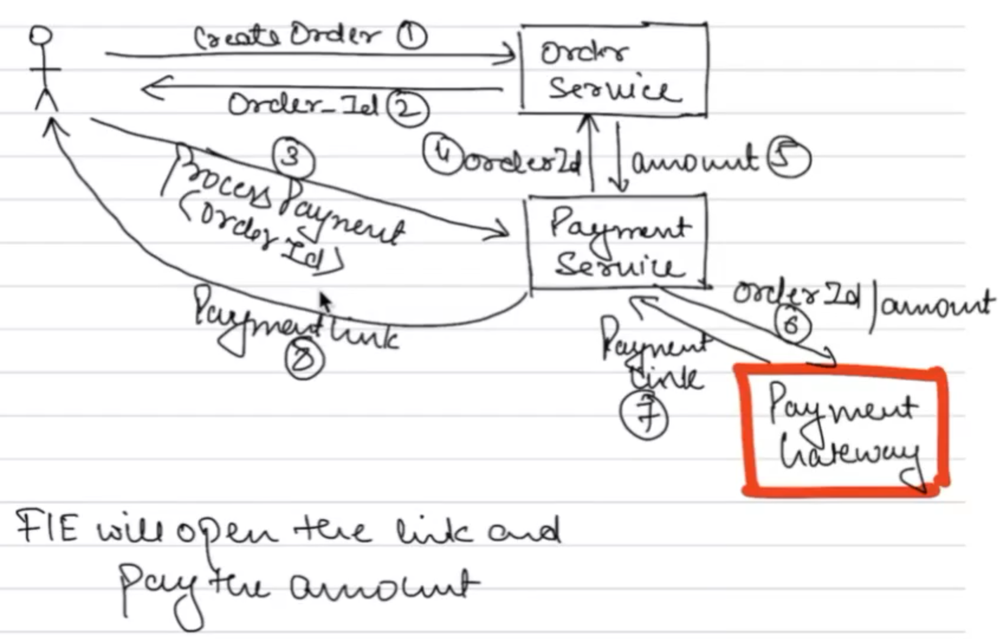
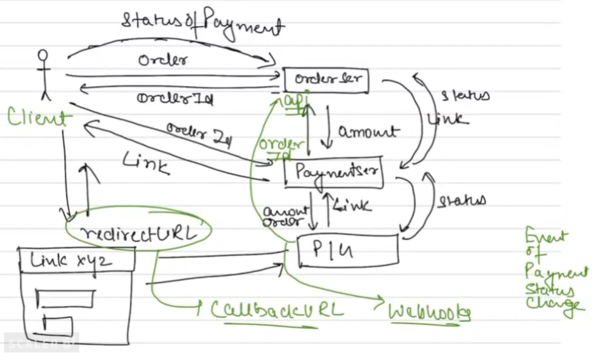

# Payment Service

## Things to discuss

1. Callback URLs
2. Webhooks
3. Reconciliation

## How the payment process works

### What's the complexity

- It needs a lot of
    - security
    - privacy
- A huge variety of payment modes are possible
    - UPI, CC, DC, Net-banking(IMPS, NEFT, RTGS), DD, Cheques, Wallets
- A lot of regulations
    - Certifications
    - RBI scrutiny for compliance

### How do we integrate Payment Service

There are two options, Build or Buy.

| Build | Buy |
| - | - |
| Build the software system in-house | Use a 3rd-party system |
| Big organizations can build their own systems | Startups are better off using managed services |

## Payment Gateway Theory

It's a third party vendor that provides payment related functionality. For example:
- RazorPay
- PayTm
- PayUMoney
- CitrusPay
- CCAvenue
- Billdesk
- PhonePe

Globally, the most famous is [Stripe](https://stripe.com/payments) and PayPal.

These vendors support most of the online payment options, and charge commissions on the payments made to the merchant.

The standard way is to first place an order, and then use the OrderId returned to map with the PaymentId. Some f the advantages of this approach are:
- If the payment fails, we can allow the user to retry after 10 min on the same orderId, before we mark it cancelled or failed.
- In cases of refunds, we can just go to the orderId and return the payment mapped
- Tracking is easy, success, failed, cancelled, etc.
- Idempotency is supported. On slower connections, we don't want a user getting charged twice by clicking on the Pay button twice. Once an OrderId is generated, it acts as the Idempotent Key to not make a duplicate payment

### Order of Requests

`OrderService`

`POST` `/orders`
```json
{
    "items":[],
    "userId": "",
    "time": ""
}
```

Upon a successful order, we get back an `OrderId`.

`PaymentService`

`POST` `/razorpay.com/payments` - *Payment Gateway*
```json
{
    "orderId": "",
    "amount": "",
    "time": ""
}
```

Upon a successful order, we get back a `status`.



These calls shouldn't be made from the Frontend directly because the Payment calls can be intercepted and tampered with.

Now when the user uses the payment link and makes the payment, we're prompted with a message saying, please don't refresh the page or hit back. At this point, once the payment is successful and the status of the payment changes, a callback URL is called for subsequent processing.

### Callback URLs

When the status of the Payment changes, either Success or Failure, Callback URLs redirect the person to the relevant page.

Example: `amazon/callback/order_id/....`

But the payment status can be anything, if you're redirected to the above same link in all cases, how will we know:
- Whether the payment succeeded or failed
- Order Confirmation
- Invoice
- Update Db

> How do we deal with this?

- Maybe after the transaction, Order Service can call the Payment Service to ask the Payment Gateway for the status.
- But whenever we're getting redirected, there can be a scenario that we pressed the back button, or closed the tab.
    - Redirection will not work
- There can be internet issues on client side due to which the redirection might not work. Hence, if the Payment Gateway can directly call the Order Service and update the status, we can get rid of situations where the status is not updated. This is possible using Webhooks.

### Webhooks

Webhooks are extremely useful in scenarios where you need to receive real-time updates from an external service, such as a payment gateway. In the context of a payment system, webhooks can provide several benefits:

**Benefits of Using Webhooks in Payment Scenarios**
1. Real-Time Updates:
    - Webhooks allow the payment gateway to notify your application immediately when the status of a payment changes (e.g., success, failure, pending).
    - This ensures that your application can react to payment status changes in real-time without having to poll the payment gateway for updates.

2. Reliability:
    - Webhooks provide a reliable way to receive updates even if the user closes the browser, navigates away from the page, or experiences internet issues.
    - Since the payment gateway sends the webhook directly to your server, it bypasses any client-side issues that might prevent the status update from being received.

3. Decoupling:
    - Webhooks decouple the payment processing logic from the user interface. This means that your application can handle payment status updates independently of the user's actions.
    - This separation of concerns makes your application more robust and easier to maintain.

4. Automatic Updates:
    - With webhooks, the payment gateway can automatically update your order service with the payment status. This reduces the need for manual intervention and ensures that your database is always up-to-date with the latest payment information.

**Possible RazorPay Settings**

- Webhooks - `orderservice.amazon.com/...`
- Events
    - Payment Success
    - Payment Failed

### API Calls vs Webhooks vs Callback URLs

| **API Calls** | **Webhooks** | **Callback URLs** |
|---------------|--------------|--------------------|
| An API (Application Programming Interface) call is a request made by one application to another to retrieve or send data. It is typically initiated by the client application. | A webhook is a way for an application to provide real-time information to another application. It is a server-to-server communication where the server sends data to a specified URL when a specific event occurs. | A callback URL is a URL provided by one application to another, where the latter will redirect the user after completing a specific action. It is often used in OAuth authentication and payment processing. |
| **Characteristics:**<br>- **Client-Initiated**: The client application initiates the request to the server.<br>- **Synchronous or Asynchronous**: API calls can be synchronous (waiting for a response) or asynchronous (not waiting for a response).<br>- **Polling**: In some cases, the client may need to poll the server repeatedly to check for updates. | **Characteristics:**<br>- **Server-Initiated**: The server (or service) initiates the request to the client's specified URL.<br>- **Asynchronous**: Webhooks are typically asynchronous, as the server sends the data when the event occurs.<br>- **Real-Time Updates**: Webhooks provide real-time updates without the need for polling. | **Characteristics:**<br>- **User Redirection**: The user is redirected to the callback URL after completing an action.<br>- **Client-Side**: The redirection happens on the client side (e.g., user's browser).<br>- **Dependent on User Action**: The callback URL is triggered based on user actions, such as completing a payment or logging in. |
| **Use Case:**<br>When an application needs to retrieve data from another service or send data to it.<br>**Example**: A mobile app fetching user data from a backend server. | **Use Case:**<br>When an application needs to receive real-time updates from another service.<br>**Example**: A payment gateway sending a payment status update to an e-commerce platform. | **Use Case:**<br>When an application needs to redirect the user to a specific page after completing an action.<br>**Example**: A payment gateway redirecting the user back to the e-commerce platform after completing a payment. |


### Summary so far

- **API Calls:** Client-initiated requests to retrieve or send data.
- **Webhooks:** Server-initiated requests to provide real-time updates.
- **Callback URLs:** URLs for redirecting users after completing an action.



### Fallback Mechanisms

There are multiple points of failure in the above system, and since we're dealing with money, we need High Consistency. We could have scenarios where the following things could go wrong:
- Webhook call fails
- Alternatively, API calls sent by the Order Service to get the latest status from the Payment Gateway fails.

In such cases, we need a *Reconciliation Process*.

### Reconciliation Process

Every *x hours (24h/12h/6h/...)* Payment Gateway sends a file with all the transactions that had happened in last *x hours* for that organization. This way, that organization can tally this with their database and settle discrepancies such as moving orders which are in a pending state to success or failed and initiate an Order Confirmation/Refund.

For example, we sometimes see a message on Amazon saying that "Please check the status after 4 hours".

We can use Spring Scheduled Task to create a Cron Job to run every *x hours* to check the status of the payments and perform the reconciliation steps.

## Payment Gateway Implementation

Here we're going to discuss the following things:
- Integration with RazorPay APIs
- Webhook Implementation
    - Local tunnel

### Integration with RazorPay Create Payment Link API

- Create an account with Razorpay and generate an API key in Test Mode
- Store this API key in a secure place like vault. But we'll have it in the environment variables for now
- Add Controller, Service layer to create a Payment Link based on order details fetched from Order Service using the orderId
- Service class can have multiple implementations for different Payment Gateways like RazorPay, Stripe, etc.
- To interact with these Payment Gateways, we can use their SDKs or REST APIs
  - RazorPay: [Razorpay API Docs](https://razorpay.com/docs/api/payments/payment-links/checkout-theme)
  - Stripe: [Stripe API Docs](https://stripe.com/docs/api)
- Once the payment link is generated, and we make a payment on this test link, it will redirect us to the callback URL we've provided

### Webhook Implementation

- Create a Webhook on RazorPay Dashboard and configure the events on which this webhook should be triggered. This requires us to:
  - Configure a Webhook URL by exposing an endpoint in our Payment Service to receive the webhook payload
    - This endpoint needs to be publicly accessible, so we can use a [local tunnel](https://theboroer.github.io/localtunnel-www/) to expose our local server to the internet
    - We can also use services like [ngrok](https://ngrok.com/) for this purpose
    - Follow the quick start guide on the local tunnel website to expose your local server to the internet
  - Configure the events on which the webhook should be triggered
    - For example, we can configure the webhook to be triggered on payment success, failure, etc.
- Once the webhook is configured, we can test it by making a payment and checking if the webhook is triggered successfully. Note that it will still be redirecting to the callback URL we've provided.
- Based on what event is triggered, we can update the status of the payment in our database and perform any other necessary actions

Reference: [Razorpay Webhooks](https://razorpay.com/docs/webhooks/setup-edit-payments/)

### Get Status

- We can also have an API to get the status of a payment based on the orderId from the Database (which is updated by the webhook)

### Cron Job

- Spring gives us the ability to create Cron Jobs using Scheduled Tasks.
- This works by annotating a method with `@Scheduled` and providing a cron expression to specify when the method should be executed
- It supports other arguments like `fixedRate`, `fixedDelay`, etc. to specify the interval at which the method should be executed
  - Fixed Rate: This is the interval between method invocations measured from the start time of each invocation
  - Fixed Delay: The interval between method invocations is measured from the completion time of each invocation
- Example:
  ```java
  @Scheduled(cron = "0 0 0/1 1/1 * ?") // Every hour
  public void performReconciliation() {
      // Perform reconciliation logic here
  }
  ```
  
Reference: [Spring Scheduled Tasks](https://www.baeldung.com/spring-scheduled-tasks)